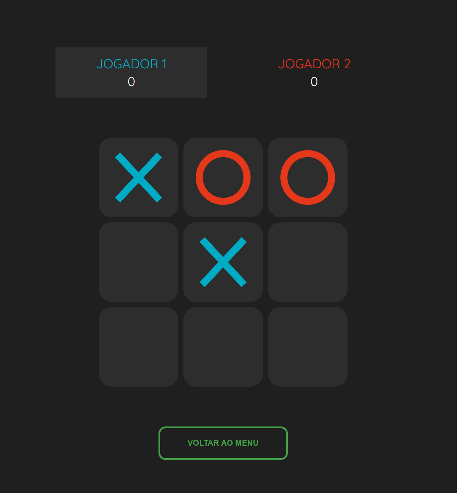

<h1>
:o: Jogo da Velha :x:
</h1>

 
 

 

Projeto criado com a finalidade de treinar lógica de programação e modificação do DOM com Javascript. Me propus a ir um pouco além do que apenas criar o jogo em sí, mas dei margem a criatividade por desenvolver animações simples, mais modos de jogo com uma IA improvisada e menu para personalização das informações dos players e escolha de ícones, além de implementar uma navegação mais dinâmica pelas sessões do jogo sem a necessidade de atualização da página. Também aproveitei para melhorar a organização do código do Javascript por separar a view da lógica, bem como a criação de um CSS mais robusto e reutilizável e a implementação da metolodiga BEM.

> Acesse o projeto online **[AQUI](https://deivisonsm.github.io/Jogo-da-Velha/)**

## :pushpin: Principais Funcionalidades

- Navegação dinâmica pelas sessões do jogo sem necessidade de atualização da página;
- 03 modos de jogo, 02 deles envolvendo IA;
- Responsividade;
- Interface do jogo simples com pequenas animações e mudanças de design para indicação de falta de informações ou ações não permitidas;
- Informações mudam de maneira dinâmica em cada sessão do jogo.

## 	:man_technologist: Tecnologias Utilizadas

- [HTML](https://developer.mozilla.org/en-US/docs/Web/HTML)
- [CSS](https://developer.mozilla.org/en-US/docs/Web/CSS)
- [Javascript](https://developer.mozilla.org/en-US/docs/Web/JavaScript)
